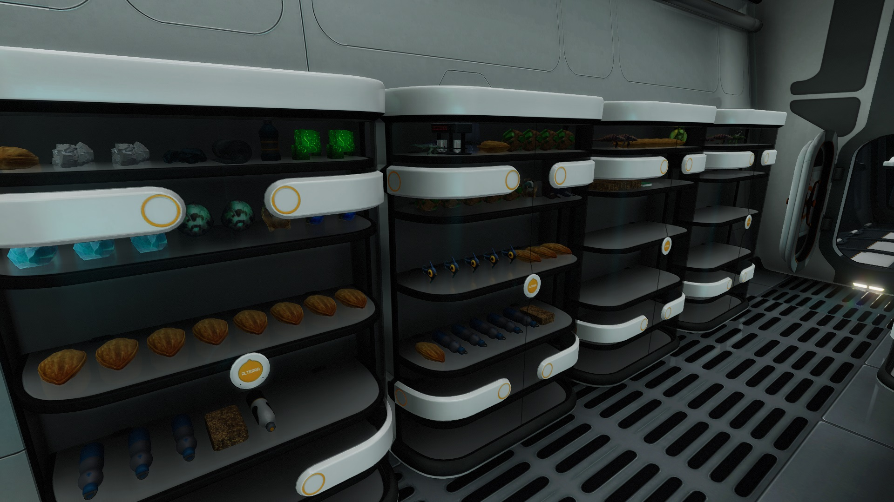
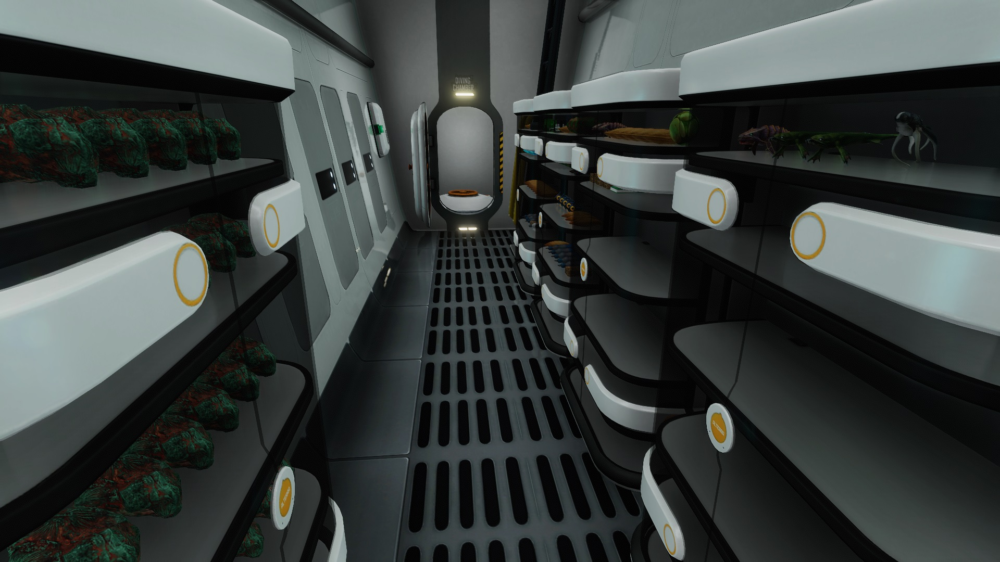

# Visible Locker Interior Mod
This mod adds the display of items on the glass inside of the locker. 

##Screenshots

##Requirements

This only needs QModManager.

##Installation

Just grab a version of your choice from Releases and put that in QMods folder.
pip install foobar

##Supported languages

This mod does well in wide selection of languages, probably because it doesn't contain any word and nothing needs to be translated

##Known issues

Some of the items won't display correctly. The process of identyfing elements of original item that have to be copied is very heuristic and multiple exceptions are needed to be implemented.

##Contributing

Any kind of feedback is welcome, and contributions as well. Feel free to open the issue, start pull request or whatever.

##License

[MIT](https://choosealicense.com/licenses/mit/), duh.